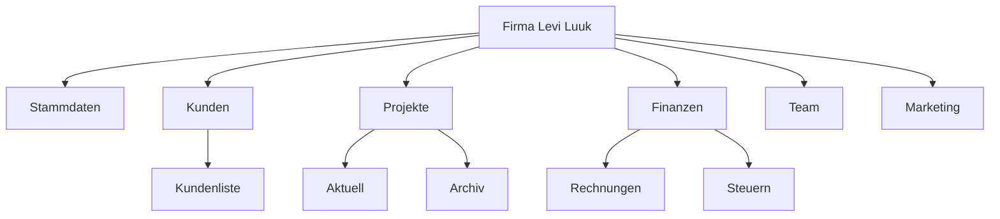

# 🏢 Firma Levi Luuk

> [!info] Zentrale Notiz
> Diese Seite ist der **Einstiegspunkt** für alle Informationen rund um die Firma Levi Luuk. Von hier aus verlinken alle Unterbereiche wie Kunden, Projekte, Finanzen und Mitarbeiter.

---

## 📌 Stammdaten

| Feld                  | Wert                |
| --------------------- | ------------------- |
| **Firmenname**        | Levi Luuk           |
| **Inhaber / GF**      |                     |
| **Rechtsform**        |                     |
| **Gründungsdatum**    |                     |
| **Steuernummer**      |                     |
| **USt-IdNr.**         |                     |
| **Handelsregister**   |                     |
| **IBAN**              |                     |
| **BIC**               |                     |
| **Bank**              |                     |

---

## 📞 Kontakt

| Feld          | Wert |
| ------------- | ---- |
| **Adresse**   |      |
| **Telefon**   |      |
| **Mobil**     |      |
| **E-Mail**    |      |
| **Website**   |      |
| **Öffnungszeiten** |  |

---

## 🎯 Tätigkeit & Leistungen

> [!note] Was bietet Levi Luuk an?

- 
- 
- 

### Zielgruppe

- 

### Alleinstellungsmerkmal (USP)

- 

---

## 👥 Team & Zuständigkeiten

| Name | Rolle | Kontakt | Notiz |
| ---- | ----- | ------- | ----- |
|      |       |         |       |
|      |       |         |       |

- [[Mitarbeiter]] — Übersicht aller Beschäftigten
- [[Aufgabenverteilung]]

---

## 🤝 Kunden

> [!tip] Verlinke jeden Kunden auf eine eigene Notiz: `[[Kunde-Name]]`

| Kunde | Status | Letzter Kontakt | Notiz |
| ----- | ------ | --------------- | ----- |
|       |        |                 |       |
|       |        |                 |       |

- [[Kundenliste]]
- [[Neukunden-Pipeline]]

---

## 📂 Projekte

| Projekt | Kunde | Status | Frist |
| ------- | ----- | ------ | ----- |
|         |       | 🟢 laufend |    |
|         |       | 🟡 wartet  |    |
|         |       | ✅ fertig  |    |

- [[Projekte/Aktuell]]
- [[Projekte/Archiv]]

---

## 💰 Finanzen

> [!warning] Buchhaltung & Steuern

| Bereich           | Verantwortlich | Notiz |
| ----------------- | -------------- | ----- |
| Buchhaltung       |                |       |
| Steuerberater     |                |       |
| Lohnabrechnung    |                |       |
| Versicherungen    |                |       |

### Wichtige Termine

- [ ] Umsatzsteuer-Voranmeldung — monatlich / quartalsweise
- [ ] Einkommensteuer-Erklärung — jährlich
- [ ] Jahresabschluss — bis 
- [ ] Sozialversicherung — monatlich

- [[Rechnungen]]
- [[Ausgaben]]
- [[Steuern]]
- [[Versicherungen]]

---

## 📣 Marketing & Online-Präsenz

| Kanal       | Adresse / Handle | Notiz |
| ----------- | ---------------- | ----- |
| Website     |                  |       |
| Instagram   |                  |       |
| Facebook    |                  |       |
| LinkedIn    |                  |       |
| Google My Business |           |       |

- [[Marketing-Plan]]
- [[Logo-und-CI]]

---

## 🛠️ Tools & Software

- [ ] Buchhaltung: 
- [ ] CRM: 
- [ ] E-Mail: 
- [ ] Cloud-Speicher: 
- [ ] Passwort-Manager: 
- [ ] Projektmanagement: 

---

## 🗂️ Wichtige Dokumente

> [!example] Verknüpfte Dateien im Vault
> - [[Gewerbeanmeldung]]
> - [[Gesellschaftsvertrag]]
> - [[AGB]]
> - [[Datenschutzerklärung]]
> - [[Vorlage-Rechnung]]
> - [[Vorlage-Angebot]]

---

## 📅 Termine & Wiedervorlage

```dataview
TASK
FROM "Firma-Levi-Luuk"
WHERE !completed
```

- [ ] 
- [ ] 

---

## 🗺️ Ziele & Roadmap

> [!todo] Was steht an?
> - [ ] **Kurzfristig (1–3 Monate):** 
> - [ ] **Mittelfristig (3–12 Monate):** 
> - [ ] **Langfristig (1+ Jahre):** 

---

## 📝 Notizen & Ideen

- 
- 
- 

---

## 🔗 MOC — Map of Content



---

## 🏷️ Tags

#firma/levi-luuk #business #dokumentation #moc

---

> [!quote]
> *„Ordnung ist das halbe Geschäft."*
