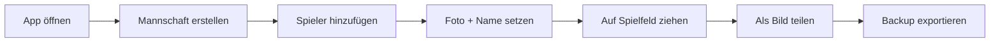

# 🏟️ Pro Team Planner Online

> [!info] Kurzbeschreibung
> Eine mobile-freundliche **Single-Page-Web-App** zum Erstellen und Verwalten von Fußball-Aufstellungen. Spieler können per Drag & Drop auf einem virtuellen Spielfeld positioniert, mit Fotos versehen und als Bild geteilt werden.

## 📌 Übersicht

| Eigenschaft     | Wert                              |
| --------------- | --------------------------------- |
| **Projektname** | meine-aufstellung                 |
| **Datei**       | [[index.html]]                    |
| **Tech-Stack**  | HTML5, CSS3, Vanilla JavaScript   |
| **Backend**     | Keine — alles im Browser          |
| **Speicher**    | `localStorage` (Schlüssel: `fb_app_v12_final`) |
| **Plattform**   | Mobile-first, responsive          |

---

## 🎯 Ziel des Projekts

Trainer, Co-Trainer und Fußballfans sollen **schnell und unterwegs** Aufstellungen zusammenstellen können — ohne Login, ohne Server, ohne Installation. Einfach Browser öffnen, Mannschaft erstellen, Spieler platzieren, Bild verschicken.

---

## ✨ Features

- [x] **Mehrere Mannschaften** anlegen und verwalten
- [x] **Spieler hinzufügen** mit Name und Foto
- [x] **Foto vom Handy** als Spielerbild (komprimiert auf 100×100 JPEG)
- [x] **Drag & Drop** auf das Spielfeld (Touch + Maus)
- [x] **Spieler-Pool** für Auswechselspieler / Kader
- [x] **Aufstellung als PNG** exportieren und teilen
- [x] **Backup (JSON)** Export / Import
- [x] **Persistenz** via `localStorage` — keine Datenverluste beim Schließen
- [x] **Spieler bearbeiten**: Name ändern, Foto wechseln, löschen

---

## 🧱 Architektur

```
meine-aufstellung/
└── index.html      ← die komplette App (HTML + CSS + JS in einer Datei)
```

> [!tip] Single-File-App
> Das gesamte Projekt steckt in einer einzigen `index.html` — kein Build-Schritt, keine Abhängigkeiten, kein npm. Datei in jeden Browser ziehen → läuft.

### 🔑 Wichtige globale Variablen

| Variable        | Bedeutung                                                   |
| --------------- | ----------------------------------------------------------- |
| `STORAGE_KEY`   | `fb_app_v12_final` — Schlüssel im `localStorage`            |
| `teams`         | Objekt: `{ "Teamname": [Spielerobjekte] }`                  |
| `currentTeam`   | Aktiv ausgewählte Mannschaft                                |
| `editingIndex`  | Index des Spielers, der gerade im Modal bearbeitet wird     |

### 📦 Datenmodell

```json
{
  "Meine Elf": [
    {
      "name": "Spielername",
      "onPitch": true,
      "x": 120,
      "y": 200,
      "img": "data:image/jpeg;base64,..."
    }
  ]
}
```

---

## 🔧 Funktionsreferenz

> [!note] JavaScript-Funktionen aus [[index.html]]

| Funktion           | Aufgabe                                                |
| ------------------ | ------------------------------------------------------ |
| `save()`           | Schreibt `teams` + `currentTeam` in `localStorage`     |
| `renderAll()`      | Baut die UI neu (Team-Auswahl, Spielfeld, Pool)        |
| `createTeam()`     | Neue Mannschaft anlegen                                |
| `switchTeam()`     | Aktive Mannschaft wechseln                             |
| `addPlayer()`      | Neuen Spieler in aktueller Mannschaft anlegen          |
| `startDrag()`      | Drag-Logik (Touch + Maus) für Spielfeld ↔ Pool         |
| `openModal()` / `closeModal()` | Spieler-Optionen-Dialog               |
| `handleFile()`     | Foto wählen, auf 100×100 skalieren, als JPEG speichern |
| `changeName()`     | Spielernamen ändern                                    |
| `removePlayer()`   | Spieler aus Mannschaft entfernen                       |
| `sharePitch()`     | Spielfeld als PNG (`aufstellung.png`) exportieren      |
| `exportData()`     | Komplettes Backup als `kader_backup.json` exportieren  |
| `importData()`     | Backup importieren                                     |

---

## 📱 Bedienung



### Schritt für Schritt

1. **Mannschaft erstellen** → Namen eingeben → *„Mannschaft erstellen"*
2. **Spieler hinzufügen** → Namen eingeben
3. **Auf Spieler tippen** → Foto wählen / Name ändern / löschen
4. **Spieler aus dem Pool** auf das grüne Feld ziehen
5. **„📤 Als Bild versenden"** → PNG wird heruntergeladen
6. **„💾 Export"** → JSON-Backup auf das Gerät speichern

---

## 🎨 Design-Notizen

- **Farbschema:** dunkler Hintergrund (`#121212`), Spielfeld-Grün (`#2e7d32`), Akzent-Grün (`#27ae60`)
- **Mobile-first:** maximale Breite 400 px, Spielfeld 340 × 460 px
- **Touch-optimiert:** `touch-action: manipulation`, große Buttons, eigene Touch-Handler
- **Kein Framework:** alle Animationen / Layouts über CSS-Variablen

---

## 🗺️ Roadmap & Ideen

> [!todo] Mögliche nächste Schritte
> - [ ] Formationen-Templates (4-4-2, 4-3-3, 3-5-2)
> - [ ] Rollen / Positionen pro Spieler
> - [ ] Mehrere Aufstellungen pro Mannschaft (Plan A / Plan B)
> - [ ] PWA-Manifest + Service Worker → offline installierbar
> - [ ] Cloud-Sync (optional, z. B. Firebase)
> - [ ] Druck-Layout (DIN A4)
> - [ ] Trikotnummern und Spielerstatistiken
> - [ ] Dunkel-/Hell-Modus-Umschalter

---

## 🐛 Bekannte Einschränkungen

> [!warning] Achtung
> - **`localStorage` ist gerätegebunden** — Daten gehen verloren, wenn Browserdaten gelöscht werden → regelmäßig **Backup exportieren**!
> - **Fotos werden auf 100×100 JPEG komprimiert** — knackscharfe Bilder sind nicht möglich (bewusst, um `localStorage`-Limit von ~5 MB nicht zu sprengen)
> - **Kein Multi-Device-Sync** — Backup muss manuell übertragen werden
> - **Versions-Schlüssel `v12_final`** — bei einem Schema-Wechsel muss ein Migrations-Pfad eingebaut werden

---

## 🔗 Verwandte Notizen

- [[index.html]] — die App selbst
- [[Roadmap]]
- [[Bedienungsanleitung]]
- [[Backup-Strategie]]

---

## 🏷️ Tags

#projekt/aufstellung #web-app #vanilla-js #mobile-first #fussball #taktik

---

> [!quote]
> *„Eine Aufstellung sagt mehr als tausend Worte."*
